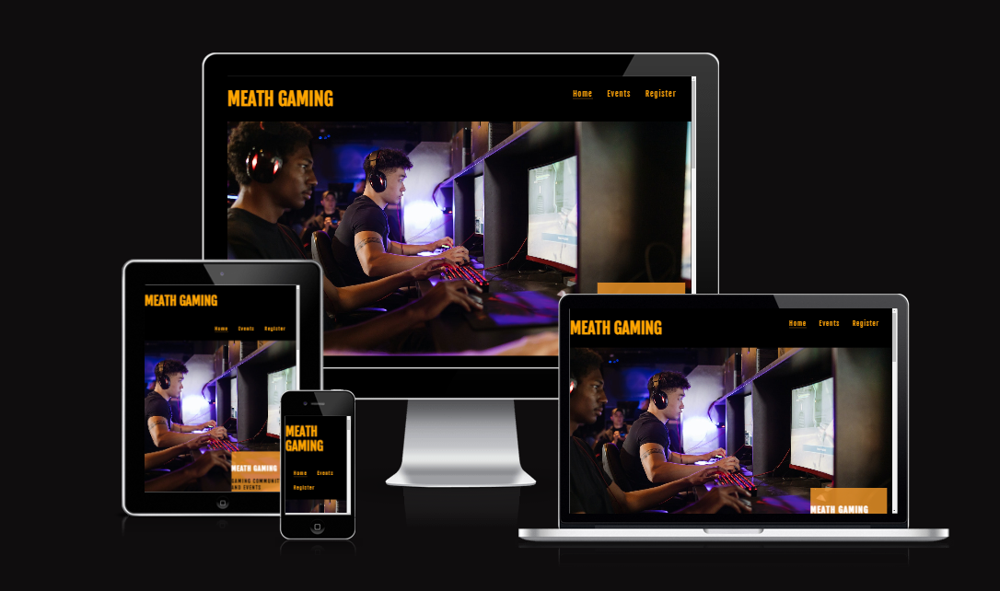
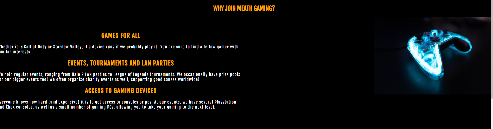
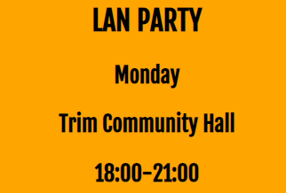
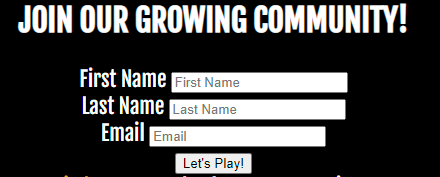
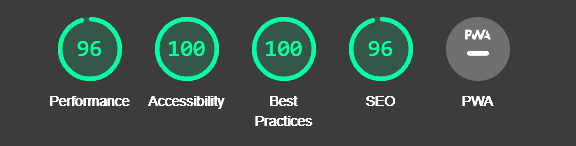

# Meath Gaming

Meath Gaming is a website designed by a community of gamers based in County Meath, Ireland. The purpose of the site is to welcome enthusiasts, beginners and veterans alike, to the community, and allow them to register their interest. Due to the pandemic, I believe there is a need for us to socialise and interact with each other more. I hope that this website can help facilitate this to some extent.

## Features

* Navigation: The navigation bar, in the top right corner, allows users to navigate to the three main sections: Home, Schedule and Register. This should allow the user to easily navigate the sections of the website.

    

* Why Join: This section details a few of the reasons why someone might be interested in joining up with Meath Gaming. The section identifies three main reasons why someone should join Meath Gaming, and details those reasons in a clear and concise way. When using the website on larger screens, such as laptops, there is an additional image to improve the look of the website.
    
    

* Schedule: The website has a schedule that details the weekly community activities. It is broken down by weekday. Under each day, it details the time of the activities in a 24 hr format, as well as what activity is on that day. The schedule is presented in a vertical format, allowing users to easily scroll through the schedule at their leisure.

    

* Sign Up Form: The form allows users to enter their details if they are interested in joining the community. First name, last name and email must be entered in order to successfully sign up. Otherwise a message will pop up, saying that a field has been left blank.

    

* Footer: The footer contains link for social media sites, consisting of Facebook, Twitter and Instagram. When users selct one of these links, they are then directed to the correct social media site in a new tab. These links are at the bottom of the website.

    

* Future Plans: Possible change in location where form details are submitted, to somewhere more user friendly.

## Testing

* I have confirmed that the website looks good, is responsive and functions on all standard screen sizes. The main way I tested this was using [Responsive Design Checker.](https://responsivedesignchecker.com/)

* Deployed site was tested in a number of web browsers, including Google Chrome, Microsoft Edge and Firefox.

* I have tested that the form works as intended, requiring the user to leave no field blank to submit.

* I have confirmed that all text, including the header, titles, paragraphs, the schedule and the footer are all easy to read and straightforward to understand.

## Validator Testing

* HTML:
    * Code was validated through the [W3 Official Validator](https://validator.w3.org/nu/), no errors found.

* CSS:
    * Code was validated through the [Jigsaw CSS Validator](https://jigsaw.w3.org/css-validator/), no errors found.

* Accessibility:
    * I confirmed that my fonts were easy to read using Lighthouse in devtools.

    

## Unfixed Bugs

No unfixed bugs remain in the project.

## Deployment

After I was satisfied with my work in Gitpod, I then pushed my work to Github. The website was then deployed via Github Pages.

## Credits

* Content: Inspiration for the layout of the navigation came from the Love Running Project. Font was chosen from [Google Fonts](https://fonts.google.com/)

* Media: Both images included in the webpage are from [Pexels](https://www.pexels.com/). Readme images were mainly screenshots of the live website, with the exception of the Lighthouse report, which was generated using devtools.

* Extra Help: Some general questions of mine for the project were answered in the Slack channels.

* [W3S Schools](https://www.w3schools.com/) was an invaluable resource throughout the project, reinforcing my understanding of course material.